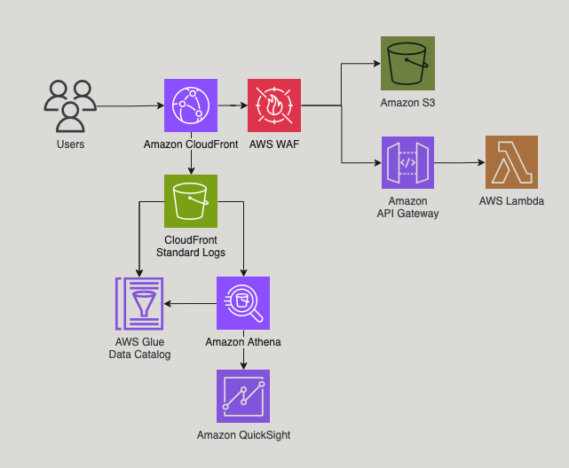

# Amazon CloudFront behavior-based cost charge-back logging

The solution uses Amazon CloudFront to “charge-back” or allocate/identify CDN costs at a more granular level to better track spend by origin or behavior. The following cost aspects are tracked, on a per behavior basis, for the distribution based on CloudFront standard logs: data transfer out (DTO), requests, CloudFront function invocations, Lambda@Edge invocations, and data transfer out to origin.

This solution does NOT track Lambda@Edge total cost because you will need to aggregate CloudWatch logs in different Regional Edge Caches (RECs) to determine duration charges. More information on how this can be accomplished can be found [here](https://aws.amazon.com/blogs/networking-and-content-delivery/aggregating-lambdaedge-logs/).

## Solution Architecture



## Requirements

- Node.js 18.x
- AWS CDK 2.59.x
- Configured AWS credentials


## Deploy on AWS

1. Clone git repository and navigate to CDK project

```bash
git clone https://github.com/aws-samples/amazon-cloudfront-charge-back-logging.git
cd amazon-cloudfront-charge-back-logging
```

2. Install CDK

```bash
npm install
```

3. Run CDK commands to bootstrap, synthesize, and deploy the CDK stack

```bash
cdk bootstrap
cdk synth
cdk deploy
```

## How to use

CloudFront standard logs will begin to populate as soon as traffic starts flowing through the
distribution. You can visit each of the domain URLs manually in your browser or adjust the shell
script below, inserting the distribution URL output from the CDK.

```bash
base_url="<your template output domain>"
get_urls=("$base_url" "$base_url/EdgeLambda.html" "$base_url/EdgeFunc.html")
post_url="$base_url/api/"

# Function to perform random GET or POST request
perform_request() {
    # Generate a random number between 0 and 4
    random_number=$((RANDOM % 5))

    # If the random number is 4, perform a POST request
    if [ $random_number -eq 4 ]; then
        echo "Performing POST request to $post_url"
        curl -X POST "$post_url"
    else
        # Get a random URL from the get_urls array
        random_url=${get_urls[$random_number]}
        echo "Performing GET request to $random_url"
        curl "$random_url"
    fi
}

for i in {1..10000}
do
    echo "Iteration $i"
    perform_request
    echo ""  # Add an empty line for better readability
done
```


4. If this is the first-time using Athena in your AWS account, then you must setup 
an Amazon S3 output bucket for query results. There is a banner to walk you through 
the setup, but more information can be found on the [Getting Started](https://docs.aws.amazon.com/athena/latest/ug/getting-started.html) page.

5. Once you're able to query the `cf-logs-table` in the `chargeback_database`. The [`charge-back-athena-sql.sql`](charge-back-athena-sql.sql) can be used to create your aggregation table.

[Athena Query Example](images/athena-query-example-output.png)

6. Configure QuickSight bucket permissions by navigating to "Manage Permissions" in the top right of the console > Security & permissions > QuickSight access to AWS services > Manage. Here you can select the S3 buckets QuickSight has access to by selecting the CloudFront logging bucket created by the CDK.

## Testing CDK constructs
```
npm test
```

## Destroy CDK app resources

To clean up your CDK app run the below command:
```bash
cdk destroy --all
```

Please be aware that some resources aren't automatically deleted and either 
need a retention policy that allows deletes or you need to delete them manually 
in you AWS account. Deleting Lambda@Edge might fail because the function can 
only be deleted after replicas of the function have been deleted by CloudFront.

## Useful commands

* `npm run build`   compile typescript to js
* `npm run watch`   watch for changes and compile
* `npm run test`    perform the jest unit tests
* `cdk deploy`      deploy this stack to your default AWS account/region
* `cdk diff`        compare deployed stack with current state
* `cdk synth`       emits the synthesized CloudFormation template

## Security

See [CONTRIBUTING](CONTRIBUTING.md#security-issue-notifications) for more information.

## License

This sample code is licensed under the MIT-0 License. See the LICENSE file.